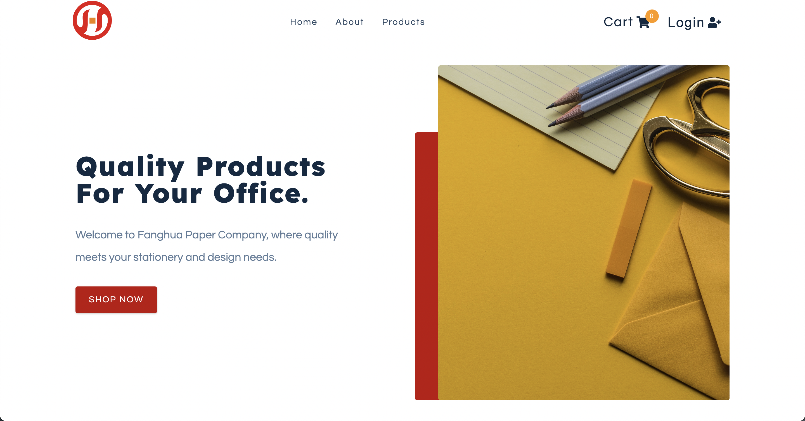
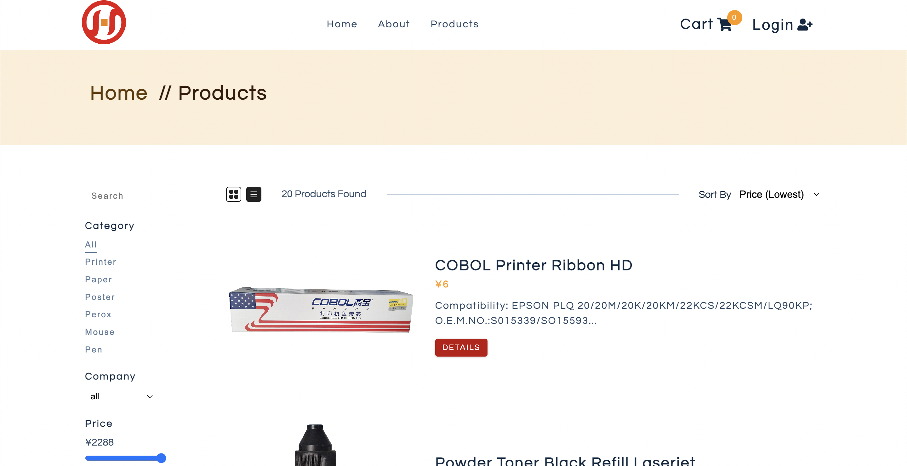
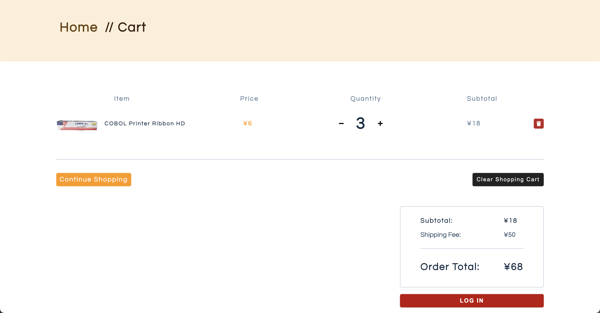
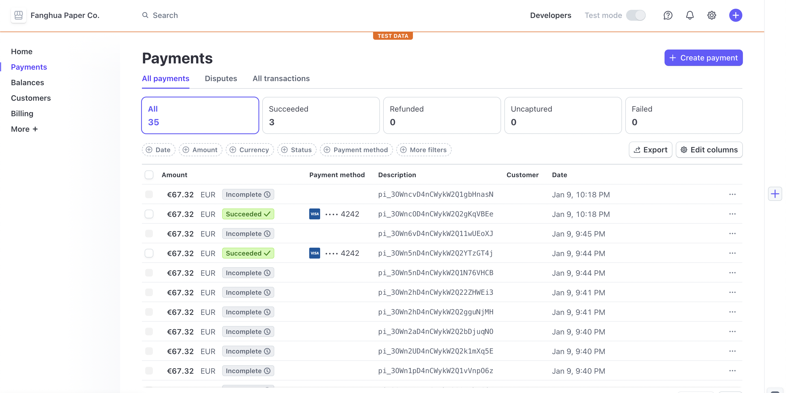

# Fanghua Paper Company E-commerce Website

This is an e-commerce website for a paper company to expand their international business.

**Live App Demo**:
https://fanghua.netlify.app/

---

## Screenshots









## Tech Stack

`react 18.2.0`

`react-router-dom 6.21.1`

`axios 1.1.3`

`netlify-cli 12.1.0`

`airtable` `auth0` `serverless function` `stripe 10.16.0`

## Installation

```
git clone git@github.com:stellaWangg/fanghua-store.git

npm install

npm start
```

- Ensure that NodeJS and npm are installed on the system.

- Create a .env file. Write your own environment variables in the .env file.

## Environment Variables

To run this project, you will need to add the following environment variables to your .env file

`REACT_APP_AUTH_DOMAIN`

`REACT_APP_AUTH_CLIENT_ID`

`REACT_APP_STRIPE_SECRET_KEY`

`REACT_APP_STRIPE_PUBLIC_KEY`

## API Reference

Used serverless function to build the relevant API.

#### Get all products

```http
  GET https://fanghua-paper.netlify.app/.netlify/functions/products
```

#### Get single product

```http
  GET https://fanghua-paper.netlify.app/.netlify/functions/products?id=${id}
```

| Parameter | Type     | Description                          |
| :-------- | :------- | :----------------------------------- |
| `id`      | `string` | **Required**. Id of product to fetch |

## Features

- Secure payment by using Stripe
- Updating database
- Authentication
- Cross platform

## Deployment

To deploy this project run

```bash
  npm run deploy
```

## Roadmap

#### Pick Product Photos from Client

- high quality product images
- at least 2 images

#### Create Airtable Account

- setup base and table
- add products

#### Create Stripe Account

- setup account and personal Key

#### Serverless Functions

- in functions create
- products.js

```
#### Install Airtable-Node
npm i airtable-node

```

## Contact

Stella - [Email](stellawang827@gmail.com)

Portfolio: [Stella Wang](https://stellawang.netlify.app/)
